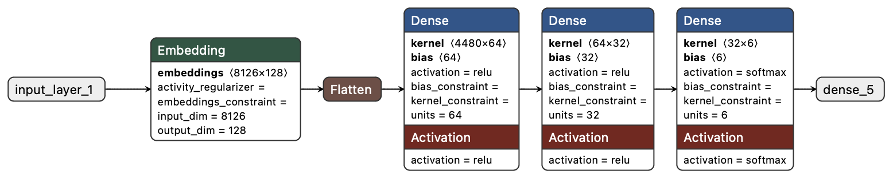
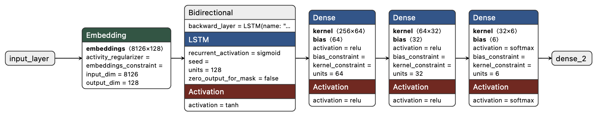
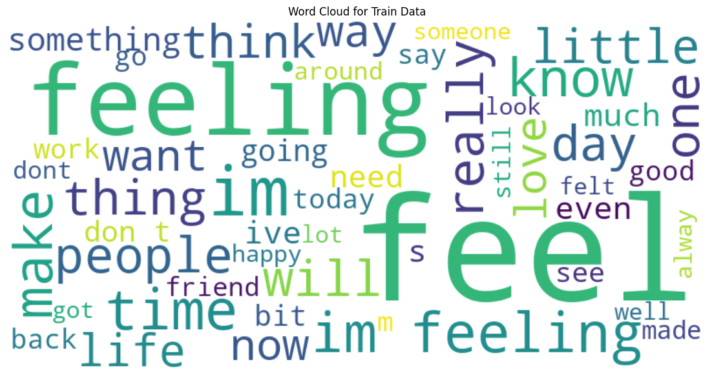
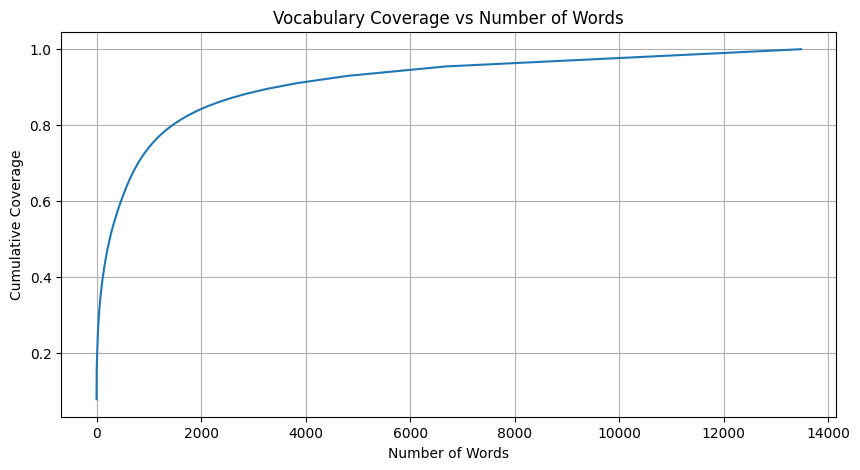
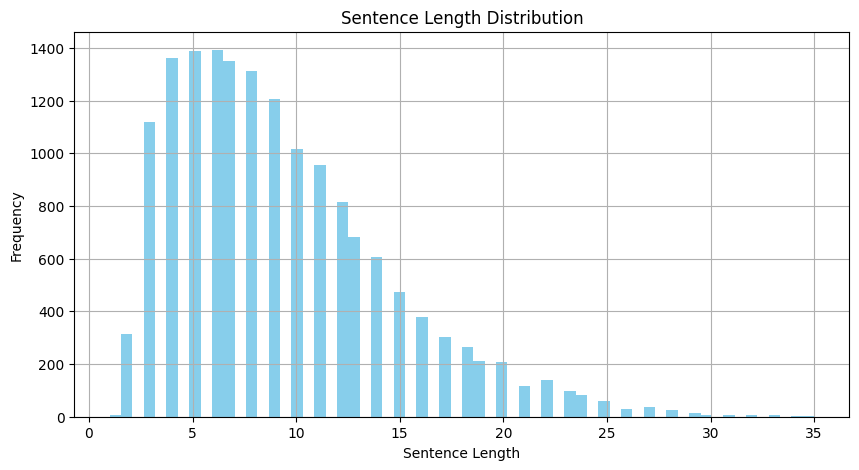

# Emotion Classification using Deep Learning and Transformers

## Project Overview
This project focuses on emotion classification using different deep learning models, including:
- Fully Connected Neural Network (ANN) `notebooks/1-Fully_Connected_NN.ipynb`
- Recurrent Neural Network (LSTM) `notebooks/2-Recurrent_NN_LSTM.ipynb`
- Transformer-based models (BERT and DistilBERT) `notebooks/3-Pretrained_model.ipynb`

The dataset consists of textual data labeled with emotions. The objective is to classify the text into different emotion categories using deep learning techniques.

## Models Used
We experimented with the following models:
1. **Artificial Neural Network (ANN)**
<p align="center">
    
</p>

2. **Long Short-Term Memory (LSTM)**
<p align="center">
    
</p>

3. **Bidirectional Encoder Representations from Transformers (BERT)**
4. **DistilBERT (a lighter version of BERT)** To see the model architecture you can check it in `images/distilbert_model_weights.h5.png` because it's very big to put it in the `README` file.


## Why DistilBERT instead of BERT?
Initially, we tried to train a BERT-based model (`bert-base-uncased`), but we encountered significant computational issues, causing the kernel to crash. Since BERT is large and computationally expensive, we switched to DistilBERT (`distilbert-base-uncased`), which is a smaller and more efficient version while maintaining a good level of performance.

## Dataset
The dataset used for training and testing consists of textual data labeled with emotions. The data is divided into three sets:
- `train.txt`
- `validation.txt`
- `test.txt`

Each file contains text samples with corresponding emotion labels.

### Data Exploration
<p align="center">
    
</p>

<p align="center">
    
</p>

<p align="center">
    
</p>

<p align="center">
    
</p>

## Training Process
1. **Data Preprocessing:**
   - Read and merge datasets.
   - Encode labels using `LabelEncoder`.
   - Tokenize text using the respective model tokenizer.

2. **Model Training:**
   - Convert text data into TensorFlow datasets.
   - Train models with appropriate batch sizes and learning rates.

3. **Evaluation:**
   - Compare model performance using accuracy, loss, and validation metrics.
   - Generate a classification report.

## Results and Comparative Analysis
| Model   | Training Time | Accuracy | Loss   | Validation Accuracy | Validation Loss |
|---------|--------------|----------|--------|---------------------|-----------------|
| ANN     | 12s          | 0.9927   | 0.0282 | 0.8685              | 0.4748          |
| LSTM    | 2min         | 0.9767   | 0.0577 | 0.9080              | 0.3010          |
| BERT    | 123min       | 0.9717   | 0.0645 | 0.9435              | 0.1827          |

## Model Summaries

### **DistilBERT Model**
```
Model: "tf_distil_bert_for_sequence_classification"
_________________________________________________________________
 Layer (type)                Output Shape              Param #   
=================================================================
 distilbert (TFDistilBertMa  multiple                  66,362,880  
 inLayer)                                                        
                                                                 
 pre_classifier (Dense)      multiple                  590,592    
                                                                 
 classifier (Dense)          multiple                  4,614      
                                                                 
 dropout_19 (Dropout)        multiple                  0         
                                                                 
=================================================================
Total params: 66,958,086 (255.42 MB)
Trainable params: 66,958,086 (255.42 MB)
Non-trainable params: 0 (0.00 Byte)
```

### **LSTM Model**
```
Model: "sequential_2"
┏━━━━━━━━━━━━━━━━━━━━━━━━━━━━━━━━━┳━━━━━━━━━━━━━━━━━━━━━━━━┳━━━━━━━━━━━━━━━┓
┃ Layer (type)                    ┃ Output Shape           ┃       Param # ┃
┡━━━━━━━━━━━━━━━━━━━━━━━━━━━━━━━━━╇━━━━━━━━━━━━━━━━━━━━━━━━╇━━━━━━━━━━━━━━━┩
│ embedding_2 (Embedding)         │ (32, 35, 128)          │     1,040,128 │
├─────────────────────────────────┼────────────────────────┼───────────────┤
│ bidirectional_1 (Bidirectional) │ (32, 256)              │       263,168 │
├─────────────────────────────────┼────────────────────────┼───────────────┤
│ dense_7 (Dense)                 │ (32, 64)               │        16,448 │
├─────────────────────────────────┼────────────────────────┼───────────────┤
│ dense_8 (Dense)                 │ (32, 32)               │         2,080 │
├─────────────────────────────────┼────────────────────────┼───────────────┤
│ dense_9 (Dense)                 │ (32, 6)                │           198 │
└─────────────────────────────────┴────────────────────────┴───────────────┘
 Total params: 3,966,068 (15.13 MB)
 Trainable params: 1,322,022 (5.04 MB)
 Non-trainable params: 0 (0.00 B)
```

### **ANN Model**
```
Model: "sequential_1"
┏━━━━━━━━━━━━━━━━━━━━━━━━━━━━━━━━━┳━━━━━━━━━━━━━━━━━━━━━━━━┳━━━━━━━━━━━━━━━┓
┃ Layer (type)                    ┃ Output Shape           ┃       Param # ┃
┡━━━━━━━━━━━━━━━━━━━━━━━━━━━━━━━━━╇━━━━━━━━━━━━━━━━━━━━━━━━╇━━━━━━━━━━━━━━━┩
│ embedding_1 (Embedding)         │ (32, 35, 128)          │     1,040,128 │
├─────────────────────────────────┼────────────────────────┼───────────────┤
│ flatten (Flatten)               │ (32, 4480)             │             0 │
├─────────────────────────────────┼────────────────────────┼───────────────┤
│ dense_3 (Dense)                 │ (32, 64)               │       286,784 │
├─────────────────────────────────┼────────────────────────┼───────────────┤
│ dense_4 (Dense)                 │ (32, 32)               │         2,080 │
├─────────────────────────────────┼────────────────────────┼───────────────┤
│ dense_5 (Dense)                 │ (32, 6)                │           198 │
└─────────────────────────────────┴────────────────────────┴───────────────┘
 Total params: 3,987,572 (15.21 MB)
 Trainable params: 1,329,190 (5.07 MB)
 Non-trainable params: 0 (0.00 B)
```


### Key Observations
- ANN is the fastest to train but has lower validation accuracy.
- LSTM provides a good balance between speed and performance.
- BERT delivers the best validation accuracy but is extremely computationally expensive.
- Due to kernel crashes while training BERT, we opted for DistilBERT, which provides a similar performance with lower computational requirements.

## Challenges & Learnings

Initially, we aimed to use **BERT** for emotion classification due to its superior NLP performance. However, every time we tried to train BERT, the **kernel crashed** due to high memory and computational requirements. To address this, we switched to **DistilBERT**, which is a smaller and computationally efficient version of BERT while maintaining high accuracy.

From this exercise, we learned:
- **Computational cost is a major factor** in model selection.
- **ANNs can be extremely fast**, but they struggle with complex text understanding.
- **LSTMs perform well**, but Transformers like BERT and DistilBERT offer better accuracy.
- **BERT achieves the best validation accuracy**, but it is computationally expensive.
- **DistilBERT is a great alternative**, offering a balance between performance and efficiency.

## Next Steps

For future text classification tasks, we would:
- Explore **other lightweight transformer models** like ALBERT or MobileBERT.
- **Optimize model architectures** to improve performance without excessive resource use.
- **Leverage cloud computing or GPUs** for training larger models.


## Used Technologies


## Contributers

<a href="https://github.com/Sa7800111" target="_blank">

</a>
<a href="https://github.com/saadkhalid-git" target="_blank">

</a>
<a href="https://github.com/AmineMrabet12" target="_blank">

</a>

- Saad Khalid
- Sangeeth Sajeev menon
- Mohamed Amine Mrabet

## Conclusion
This project explored different deep learning models for emotion classification. While BERT provided the highest accuracy, its high computational demand led us to switch to DistilBERT. DistilBERT proved to be an efficient alternative, balancing performance and resource constraints.
